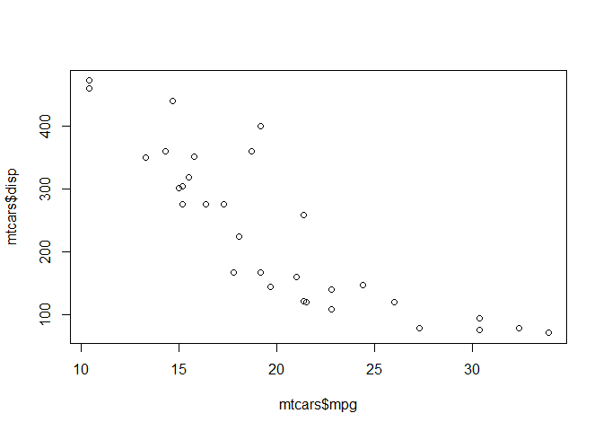
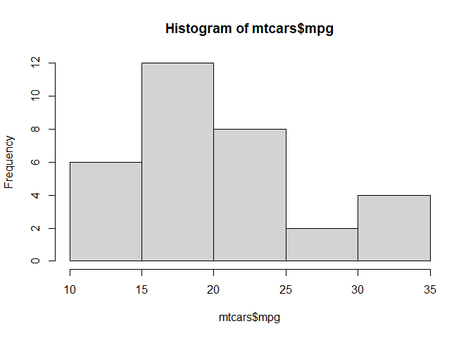
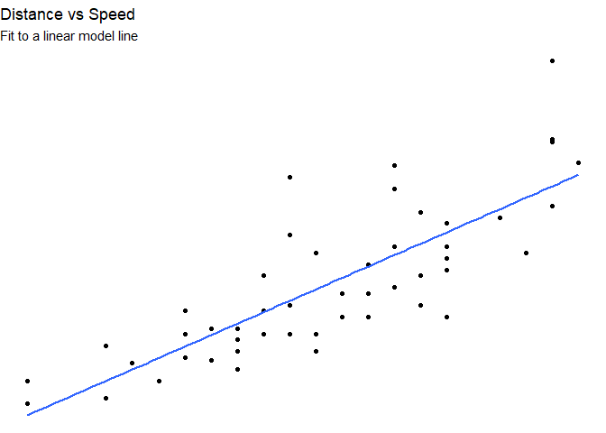
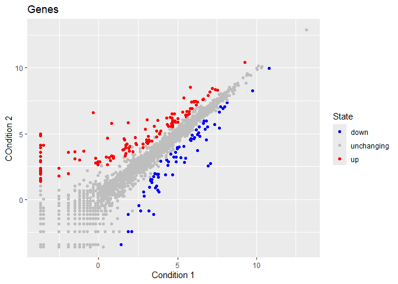
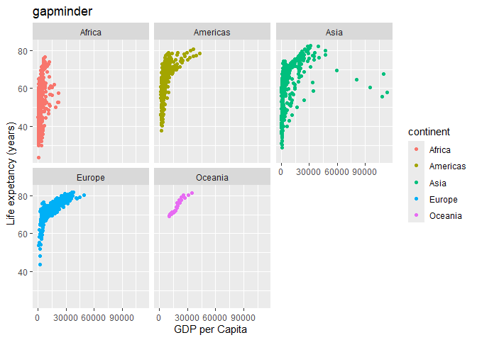

# Class05: Data vis with ggplot2
Mari Williams (PID: A15858833)

Today we will be playing with plotting and graphics in R!

There are many ways to make cool figures in R.

There are base R graphs like `plot()`, `hist()`, and `boxplot()`.

**ggplot** is a popular add-on package.

``` r
head(cars)
```

      speed dist
    1     4    2
    2     4   10
    3     7    4
    4     7   22
    5     8   16
    6     9   10

Let’s plot this with base R.

``` r
plot(cars)
```


``` r
head(mtcars)
```

                       mpg cyl disp  hp drat    wt  qsec vs am gear carb
    Mazda RX4         21.0   6  160 110 3.90 2.620 16.46  0  1    4    4
    Mazda RX4 Wag     21.0   6  160 110 3.90 2.875 17.02  0  1    4    4
    Datsun 710        22.8   4  108  93 3.85 2.320 18.61  1  1    4    1
    Hornet 4 Drive    21.4   6  258 110 3.08 3.215 19.44  1  0    3    1
    Hornet Sportabout 18.7   8  360 175 3.15 3.440 17.02  0  0    3    2
    Valiant           18.1   6  225 105 2.76 3.460 20.22  1  0    3    1

Let’s plot `mpg` vs `displacement`

``` r
plot(mtcars$mpg, mtcars$disp)
```



``` r
hist(mtcars$mpg)
```



The main function on the ggplot2 package is **ggplot()**. To install the
package, use the function `install.package`. I already had ggplot2
installed. You have to call it with `library(ggplot)`.

``` r
library(ggplot2)
ggplot(cars) + aes(speed, dist) + geom_point()
```


ggplot needs: - **data**, given with `ggplot(x)`, defines the source of
the data -**aesthetic**, given with `aes(x,y)`, defines the plotted data
and axes -**geom**, given with `geom_(point)` for example, defines how
it is visualized.

Base R is nearly always faster, but ggplot is more flexible and
customized

### Let’s add more layers

Let’s add a line, a title, a subtitle, a caption, and custom axis
labels.

``` r
ggplot(cars) + aes(speed, dist) + geom_point() + geom_smooth(method="lm", se=FALSE) + 
  labs(
    title = "Distance vs Speed",
    subtitle = "Fit to a linear model line",
    x = "Speed (mph)",
    y = "Stopping Distance (ft)") + 
  theme_void()
```

    `geom_smooth()` using formula = 'y ~ x'



### Let’s plot expression data!

``` r
url <- "https://bioboot.github.io/bimm143_S20/class-material/up_down_expression.txt"
genes <- read.delim(url)
head(genes)
```

            Gene Condition1 Condition2      State
    1      A4GNT -3.6808610 -3.4401355 unchanging
    2       AAAS  4.5479580  4.3864126 unchanging
    3      AASDH  3.7190695  3.4787276 unchanging
    4       AATF  5.0784720  5.0151916 unchanging
    5       AATK  0.4711421  0.5598642 unchanging
    6 AB015752.4 -3.6808610 -3.5921390 unchanging

> Q1. How many genes in this dataset?

``` r
dim(genes)
```

    [1] 5196    4

There are 5196 genes in this dataset

``` r
ggplot(genes) + aes(Condition1, Condition2, col=State, label=Gene) + geom_point() + scale_color_manual(values = c("blue", "gray", "red")) +
  labs(
    title = "Genes",
    x = "Condition 1",
    y = "COndition 2")  
```



\##going further

``` r
url <- "https://raw.githubusercontent.com/jennybc/gapminder/master/inst/extdata/gapminder.tsv"

gapminder <- read.delim(url)
```

``` r
head(gapminder)
```

          country continent year lifeExp      pop gdpPercap
    1 Afghanistan      Asia 1952  28.801  8425333  779.4453
    2 Afghanistan      Asia 1957  30.332  9240934  820.8530
    3 Afghanistan      Asia 1962  31.997 10267083  853.1007
    4 Afghanistan      Asia 1967  34.020 11537966  836.1971
    5 Afghanistan      Asia 1972  36.088 13079460  739.9811
    6 Afghanistan      Asia 1977  38.438 14880372  786.1134

``` r
tail(gapminder)
```

          country continent year lifeExp      pop gdpPercap
    1699 Zimbabwe    Africa 1982  60.363  7636524  788.8550
    1700 Zimbabwe    Africa 1987  62.351  9216418  706.1573
    1701 Zimbabwe    Africa 1992  60.377 10704340  693.4208
    1702 Zimbabwe    Africa 1997  46.809 11404948  792.4500
    1703 Zimbabwe    Africa 2002  39.989 11926563  672.0386
    1704 Zimbabwe    Africa 2007  43.487 12311143  469.7093

``` r
ggplot(gapminder) + aes(gdpPercap, lifeExp, col=continent, label=country) + geom_point()  +
  labs(
    title = "gapminder",
    x = "GDP per Capita ",
    y = "Life expetancy (years)")  + facet_wrap(~continent)
```



Seems lower GDP per capita can correlate with lower life expectancies.
Capitalism…
