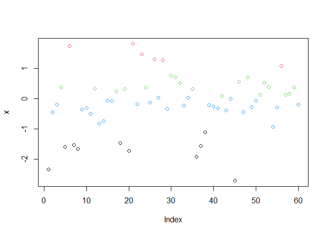
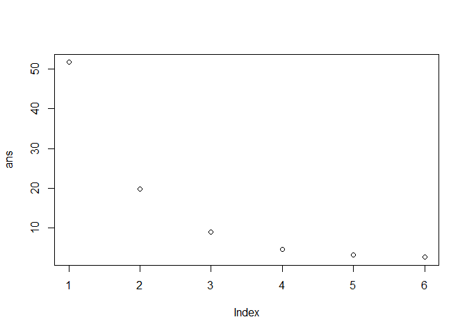
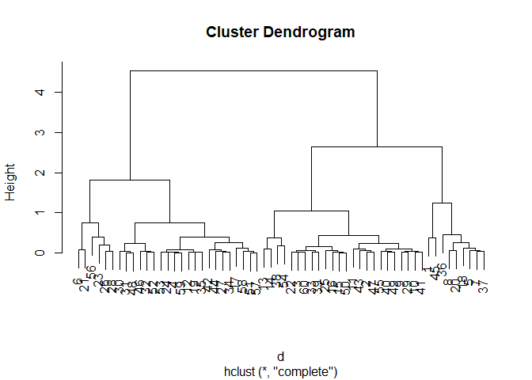
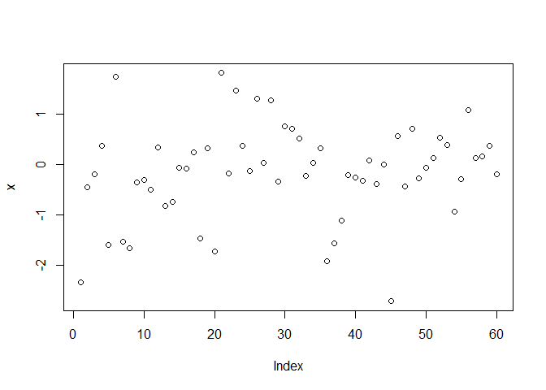
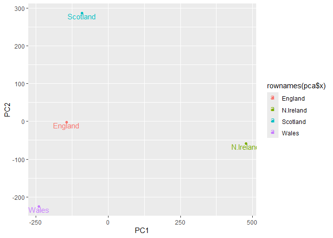
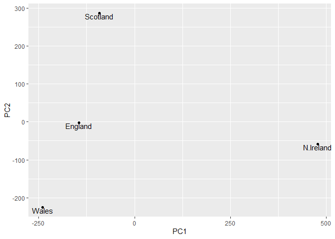

# Lab 7
Mari Williams (PID: A15858833)

### Q1

``` r
x <- read.csv("https://tinyurl.com/UK-foods")
dim(x)
```

    [1] 17  5

``` r
head(x)
```

                   X England Wales Scotland N.Ireland
    1         Cheese     105   103      103        66
    2  Carcass_meat      245   227      242       267
    3    Other_meat      685   803      750       586
    4           Fish     147   160      122        93
    5 Fats_and_oils      193   235      184       209
    6         Sugars     156   175      147       139

### K means clustering

``` r
x<-(rnorm(60))
```

``` r
k<- kmeans(x, 4)
```

``` r
plot(x, col= k$cluster)
```



``` r
ans <- NULL
for (i in 1:6){
  ans <- c(ans, kmeans(x, centers=i)$tot.withinss)
}
plot(ans)
```



``` r
d<- dist(x)
hc <- hclust(d)
```

``` r
plot(hc)
```



``` r
grps <- cutree(hc, h=7)
plot(x, col= grps)
```



### PCA

***Q1 How many rows and columns are in your new data frame named x? What
R functions could you use to answer this questions?***

``` r
x <- read.csv("https://tinyurl.com/UK-foods")
dim(x)
```

    [1] 17  5

``` r
head(x)
```

                   X England Wales Scotland N.Ireland
    1         Cheese     105   103      103        66
    2  Carcass_meat      245   227      242       267
    3    Other_meat      685   803      750       586
    4           Fish     147   160      122        93
    5 Fats_and_oils      193   235      184       209
    6         Sugars     156   175      147       139

``` r
rownames(x) <- x[,1]
x <- x[,-1]
head(x)
```

                   England Wales Scotland N.Ireland
    Cheese             105   103      103        66
    Carcass_meat       245   227      242       267
    Other_meat         685   803      750       586
    Fish               147   160      122        93
    Fats_and_oils      193   235      184       209
    Sugars             156   175      147       139

``` r
x <- read.csv("https://tinyurl.com/UK-foods", row.names=1)
head(x)
```

                   England Wales Scotland N.Ireland
    Cheese             105   103      103        66
    Carcass_meat       245   227      242       267
    Other_meat         685   803      750       586
    Fish               147   160      122        93
    Fats_and_oils      193   235      184       209
    Sugars             156   175      147       139

***Q2 Which approach to solving the ‘row-names problem’ mentioned above
do you prefer and why? Is one approach more robust than another under
certain circumstances?*** I like to read the names as it comes in via
the url, since we don’t have to deal with dropping a column after.

``` r
rainbow(nrow(x))
```

     [1] "#FF0000" "#FF5A00" "#FFB400" "#F0FF00" "#96FF00" "#3CFF00" "#00FF1E"
     [8] "#00FF78" "#00FFD2" "#00D2FF" "#0078FF" "#001EFF" "#3C00FF" "#9600FF"
    [15] "#F000FF" "#FF00B4" "#FF005A"

``` r
barplot(as.matrix(x), beside=F, col=rainbow(nrow(x)))
```


***Q3: Changing what optional argument in the above barplot() function
results in the following plot?*** beside=F

``` r
library(tidyr)
```

    Warning: package 'tidyr' was built under R version 4.3.3

``` r
# Convert data to long format for ggplot with `pivot_longer()`
x_long <- x |> 
          tibble::rownames_to_column("Food") |> 
          pivot_longer(cols = -Food, 
                       names_to = "Country", 
                       values_to = "Consumption")

dim(x_long)
```

    [1] 68  3

***Q4: Changing what optional argument in the above ggplot() code
results in a stacked barplot figure?*** Change position = “dodge” to
“stack”

``` r
library(ggplot2)

ggplot(x_long) +
  aes(x = Country, y = Consumption, fill = Food) +
  geom_col(position = "stack") +
  theme_bw()
```


***Q5: We can use the pairs() function to generate all pairwise plots
for our countries. Can you make sense of the following code and
resulting figure? What does it mean if a given point lies on the
diagonal for a given plot?*** It is the correlation of the two countries
together. Dots on the diagnol are the same for both countries on the
axis.

``` r
pairs(x, col=rainbow(nrow(x)), pch=16)
```


***Q6. Based on the pairs and heatmap figures, which countries cluster
together and what does this suggest about their food consumption
patterns? Can you easily tell what the main differences between N.
Ireland and the other countries of the UK in terms of this data-set?***
No, it’s hard to tell

``` r
library(pheatmap)

pheatmap( as.matrix(x) )
```


### PCA Time

``` r
t(x)
```

              Cheese Carcass_meat  Other_meat  Fish Fats_and_oils  Sugars
    England      105           245         685  147            193    156
    Wales        103           227         803  160            235    175
    Scotland     103           242         750  122            184    147
    N.Ireland     66           267         586   93            209    139
              Fresh_potatoes  Fresh_Veg  Other_Veg  Processed_potatoes 
    England               720        253        488                 198
    Wales                 874        265        570                 203
    Scotland              566        171        418                 220
    N.Ireland            1033        143        355                 187
              Processed_Veg  Fresh_fruit  Cereals  Beverages Soft_drinks 
    England              360         1102     1472        57         1374
    Wales                365         1137     1582        73         1256
    Scotland             337          957     1462        53         1572
    N.Ireland            334          674     1494        47         1506
              Alcoholic_drinks  Confectionery 
    England                 375             54
    Wales                   475             64
    Scotland                458             62
    N.Ireland               135             41

``` r
pca <- prcomp(t(x))

summary(pca)
```

    Importance of components:
                                PC1      PC2      PC3       PC4
    Standard deviation     324.1502 212.7478 73.87622 3.176e-14
    Proportion of Variance   0.6744   0.2905  0.03503 0.000e+00
    Cumulative Proportion    0.6744   0.9650  1.00000 1.000e+00

***Q7. Complete the code below to generate a plot of PC1 vs PC2. The
second line adds text labels over the data points.*** ***Q8. Customize
your plot so that the colors of the country names match the colors in
our UK and Ireland map and table at start of this document.***

``` r
library(ggplot2)
ggplot(pca$x) + aes(PC1, PC2, label=rownames(pca$x), colour = rownames(pca$x)) + geom_point()+ geom_text(vjust=1) + xlab("PC1") +
  ylab("PC2") 
```



``` r
ggplot(pca$x) + aes(PC1, PC2, label=rownames(pca$x)) + geom_point()+ geom_text(vjust=1) + xlab("PC1") +
  ylab("PC2") 
```


