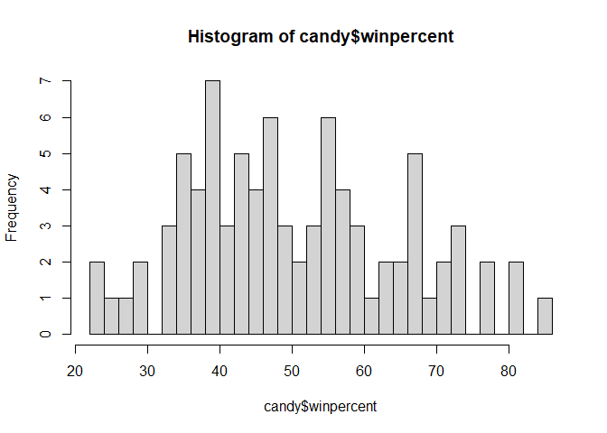
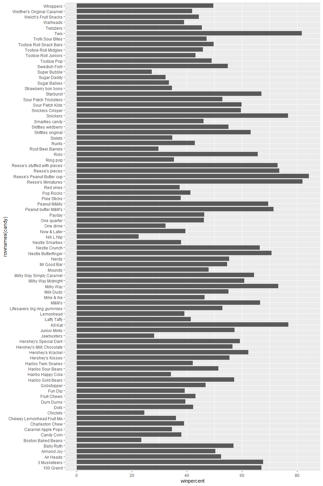
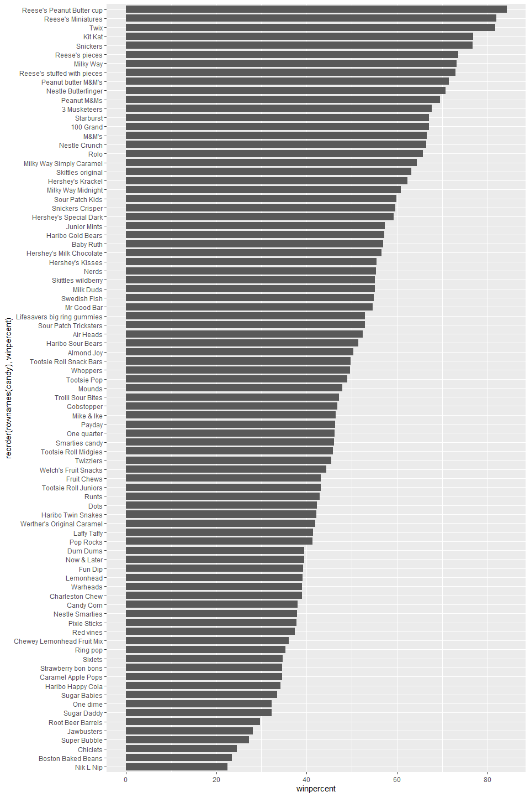
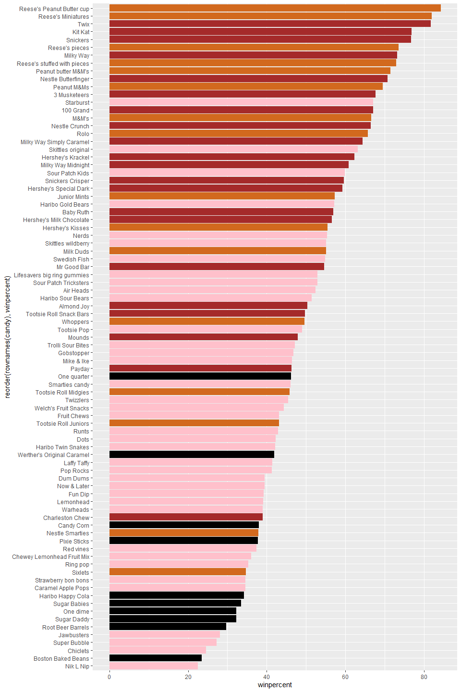
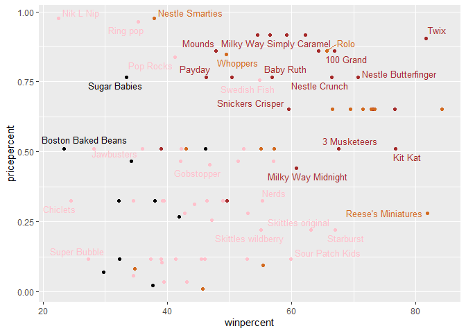
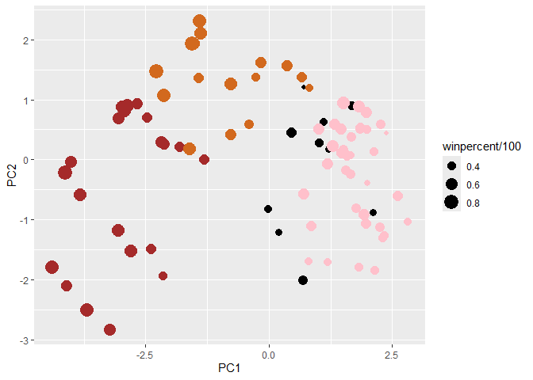

# Halloween project
Mari Williams (A15858833)

``` r
candy <- read.csv(url("https://raw.githubusercontent.com/fivethirtyeight/data/master/candy-power-ranking/candy-data.csv"), row.names=1)
head(candy)
```

                 chocolate fruity caramel peanutyalmondy nougat crispedricewafer
    100 Grand            1      0       1              0      0                1
    3 Musketeers         1      0       0              0      1                0
    One dime             0      0       0              0      0                0
    One quarter          0      0       0              0      0                0
    Air Heads            0      1       0              0      0                0
    Almond Joy           1      0       0              1      0                0
                 hard bar pluribus sugarpercent pricepercent winpercent
    100 Grand       0   1        0        0.732        0.860   66.97173
    3 Musketeers    0   1        0        0.604        0.511   67.60294
    One dime        0   0        0        0.011        0.116   32.26109
    One quarter     0   0        0        0.011        0.511   46.11650
    Air Heads       0   0        0        0.906        0.511   52.34146
    Almond Joy      0   1        0        0.465        0.767   50.34755

***Q1. How many different candy types are in this dataset?***

``` r
nrow(candy)
```

    [1] 85

``` r
ncol(candy)
```

    [1] 12

85 different candies categorized in 12 descriptors

***Q2. How many fruity candy types are in the dataset?***

``` r
sum(candy$fruity)
```

    [1] 38

38

***Q3. What is your favorite candy in the dataset and what is it’s
winpercent value?***

``` r
candy["Caramel Apple Pops", ]$winpercent
```

    [1] 34.51768

Caramel Apple Pops winpercent is 34.517681

***Q4. What is the winpercent value for “Kit Kat”?***

``` r
candy["Kit Kat", ]$winpercent
```

    [1] 76.7686

***Q5. What is the winpercent value for “Tootsie Roll Snack Bars”?***

``` r
candy["Tootsie Roll Snack Bars",]$winpercent
```

    [1] 49.6535

``` r
library("skimr")
#skim(candy)
```

The skimr package was giving me issues with rendering; I ran it but had
to take it out for rendering

***Q6. Is there any variable/column that looks to be on a different
scale to the majority of the other columns in the dataset?***

The last column, winpercent, is scaled based off of 100% versus a 0 or 1
value

***Q7. What do you think a zero and one represent for the
candy\$chocolate column?***

0 means the candy is not classified as chocolate, 1 means it is

***Q8. Plot a histogram of winpercent values***

``` r
hist(candy$winpercent, 30)
```



***Q9. Is the distribution of winpercent values symmetrical?***

Skewed more towards the lower end than truly symmetrical.

***Q10. Is the center of the distribution above or below 50%?***

Below 50%

***Q11. On average is chocolate candy higher or lower ranked than fruit
candy?***

``` r
mean(candy$winpercent[as.logical(candy$fruity)])
```

    [1] 44.11974

``` r
mean(candy$winpercent[as.logical(candy$chocolate)])
```

    [1] 60.92153

Chocolate is on average ranked higher than fruity candy.

***Q12. Is this difference statistically significant?***

``` r
t.test(candy$winpercent[as.logical(candy$fruity)], candy$winpercent[as.logical(candy$chocolate)])
```


        Welch Two Sample t-test

    data:  candy$winpercent[as.logical(candy$fruity)] and candy$winpercent[as.logical(candy$chocolate)]
    t = -6.2582, df = 68.882, p-value = 2.871e-08
    alternative hypothesis: true difference in means is not equal to 0
    95 percent confidence interval:
     -22.15795 -11.44563
    sample estimates:
    mean of x mean of y 
     44.11974  60.92153 

Yes, it is statistically significant

``` r
library(dplyr)
```

    Warning: package 'dplyr' was built under R version 4.3.3


    Attaching package: 'dplyr'

    The following objects are masked from 'package:stats':

        filter, lag

    The following objects are masked from 'package:base':

        intersect, setdiff, setequal, union

***Q13. What are the five least liked candy types in this set?***

``` r
rownames(candy %>% 
  arrange(winpercent) %>%
  head(5))
```

    [1] "Nik L Nip"          "Boston Baked Beans" "Chiclets"          
    [4] "Super Bubble"       "Jawbusters"        

***Q14. What are the top 5 all time favorite candy types out of this
set?***

``` r
rownames(candy %>% 
  arrange(-winpercent) %>%
  head(5))
```

    [1] "Reese's Peanut Butter cup" "Reese's Miniatures"       
    [3] "Twix"                      "Kit Kat"                  
    [5] "Snickers"                 

***Q15. Make a first barplot of candy ranking based on winpercent
values.***

``` r
library(ggplot2)

ggplot(candy) + 
  aes(winpercent, rownames(candy)) +
  geom_col(width = .8)
```



***Q16. This is quite ugly, use the reorder() function to get the bars
sorted by winpercent?***

``` r
ggplot(candy) + 
 aes(winpercent, reorder(rownames(candy),winpercent)) +
  geom_col(width = .8)
```



``` r
my_cols=rep("black", nrow(candy))
my_cols[as.logical(candy$chocolate)] = "chocolate"
my_cols[as.logical(candy$bar)] = "brown"
my_cols[as.logical(candy$fruity)] = "pink"

ggplot(candy) + 
  aes(winpercent, reorder(rownames(candy),winpercent)) +
  geom_col(fill=my_cols) 
```



***Q17. What is the worst ranked chocolate candy?***

Sixlets

***Q18. What is the best ranked fruity candy?***

Starburst

### Price Percent

``` r
library(ggrepel)
```

    Warning: package 'ggrepel' was built under R version 4.3.3

``` r
# How about a plot of price vs win
ggplot(candy) +
  aes(winpercent, pricepercent, label=rownames(candy)) +
  geom_point(col=my_cols) + 
  geom_text_repel(col=my_cols, size=3.3, max.overlaps = 5)
```

    Warning: ggrepel: 54 unlabeled data points (too many overlaps). Consider
    increasing max.overlaps



***Q19. Which candy type is the highest ranked in terms of winpercent
for the least money - i.e. offers the most bang for your buck?***

``` r
ord <- order(candy$winpercent, decreasing = TRUE)
head( candy[ord,c(11,12)], n=5 )
```

                              pricepercent winpercent
    Reese's Peanut Butter cup        0.651   84.18029
    Reese's Miniatures               0.279   81.86626
    Twix                             0.906   81.64291
    Kit Kat                          0.511   76.76860
    Snickers                         0.651   76.67378

Reese’s Mini’s are the cheapest among the most popular (But I would
argue less bang for your buck overall, since its a miniature size of
Reese)

Q20. What are the top 5 most expensive candy types in the dataset and of
these which is the least popular?

``` r
ord <- order(candy$pricepercent, decreasing = TRUE)
head( candy[ord,c(11,12)], n=5 )
```

                             pricepercent winpercent
    Nik L Nip                       0.976   22.44534
    Nestle Smarties                 0.976   37.88719
    Ring pop                        0.965   35.29076
    Hershey's Krackel               0.918   62.28448
    Hershey's Milk Chocolate        0.918   56.49050

Nik L Nip is the least liked out of the most expensive.

### Correlation

``` r
library(corrplot)
```

    Warning: package 'corrplot' was built under R version 4.3.3

    corrplot 0.95 loaded

``` r
cij <- cor(candy)
corrplot(cij)
```


***Q22. Examining this plot what two variables are anti-correlated
(i.e. have minus values)?***

Chocolate and fruity are anti-correlated, as well as bar and fruity, and
bar and pluribus. (I like chocolate fruit candies, like chocolate
covered cherries!)

***Q23. Similarly, what two variables are most positively correlated?***

Bar and chocolate or chocolate and winpercent

### PCA

``` r
pca <- prcomp(candy, scale = TRUE)
summary(pca)
```

    Importance of components:
                              PC1    PC2    PC3     PC4    PC5     PC6     PC7
    Standard deviation     2.0788 1.1378 1.1092 1.07533 0.9518 0.81923 0.81530
    Proportion of Variance 0.3601 0.1079 0.1025 0.09636 0.0755 0.05593 0.05539
    Cumulative Proportion  0.3601 0.4680 0.5705 0.66688 0.7424 0.79830 0.85369
                               PC8     PC9    PC10    PC11    PC12
    Standard deviation     0.74530 0.67824 0.62349 0.43974 0.39760
    Proportion of Variance 0.04629 0.03833 0.03239 0.01611 0.01317
    Cumulative Proportion  0.89998 0.93832 0.97071 0.98683 1.00000

``` r
plot(pca$x[,1:2])
```


``` r
plot(pca$x[,1:2], col=my_cols, pch=16)
```


``` r
pc3 <- cbind(candy, pca$x[,1:3])
p <- ggplot(pc3) + 
        aes(x=PC1, y=PC2, 
            size=winpercent/100,  
            text=rownames(pc3),
            label=rownames(pc3)) +
        geom_point(col=my_cols)

p
```



``` r
par(mar=c(8,4,2,2))
barplot(pca$rotation[,1], las=2, ylab="PC1 Contribution")
```


***Q24. What original variables are picked up strongly by PC1 in the
positive direction? Do these make sense to you?***

Fruity and pluribus. I thought chocolate and bar would be picked up
more, but the fruity candies cluster strongly on the plot so this makes
sense.
