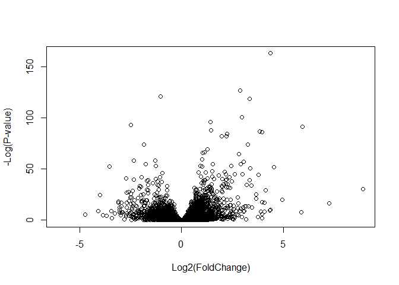
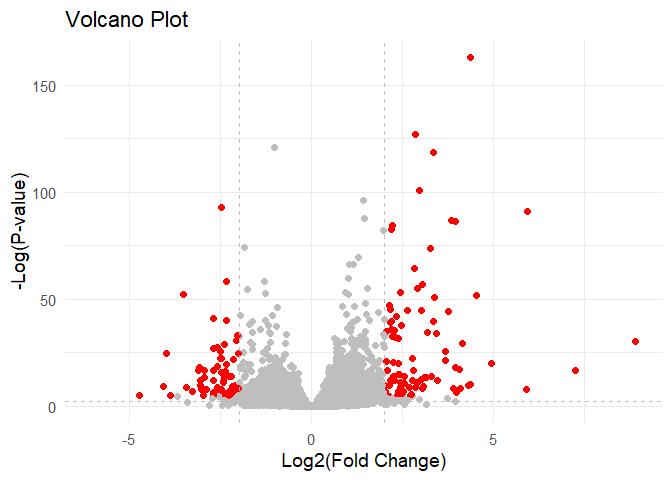

# Class 12
Mari Williams (A15858833)

- [Background](#background)
- [DESeq2](#deseq2)

## Background

Using DESeq2 to analyze some RNAseq data

``` r
library(DESeq2)
```

    Warning: package 'DESeq2' was built under R version 4.3.3

    Loading required package: S4Vectors

    Warning: package 'S4Vectors' was built under R version 4.3.2

    Loading required package: stats4

    Loading required package: BiocGenerics

    Warning: package 'BiocGenerics' was built under R version 4.3.1


    Attaching package: 'BiocGenerics'

    The following objects are masked from 'package:stats':

        IQR, mad, sd, var, xtabs

    The following objects are masked from 'package:base':

        anyDuplicated, aperm, append, as.data.frame, basename, cbind,
        colnames, dirname, do.call, duplicated, eval, evalq, Filter, Find,
        get, grep, grepl, intersect, is.unsorted, lapply, Map, mapply,
        match, mget, order, paste, pmax, pmax.int, pmin, pmin.int,
        Position, rank, rbind, Reduce, rownames, sapply, setdiff, sort,
        table, tapply, union, unique, unsplit, which.max, which.min


    Attaching package: 'S4Vectors'

    The following object is masked from 'package:utils':

        findMatches

    The following objects are masked from 'package:base':

        expand.grid, I, unname

    Loading required package: IRanges

    Warning: package 'IRanges' was built under R version 4.3.1


    Attaching package: 'IRanges'

    The following object is masked from 'package:grDevices':

        windows

    Loading required package: GenomicRanges

    Warning: package 'GenomicRanges' was built under R version 4.3.1

    Loading required package: GenomeInfoDb

    Warning: package 'GenomeInfoDb' was built under R version 4.3.3

    Loading required package: SummarizedExperiment

    Warning: package 'SummarizedExperiment' was built under R version 4.3.1

    Loading required package: MatrixGenerics

    Warning: package 'MatrixGenerics' was built under R version 4.3.1

    Loading required package: matrixStats

    Warning: package 'matrixStats' was built under R version 4.3.3


    Attaching package: 'MatrixGenerics'

    The following objects are masked from 'package:matrixStats':

        colAlls, colAnyNAs, colAnys, colAvgsPerRowSet, colCollapse,
        colCounts, colCummaxs, colCummins, colCumprods, colCumsums,
        colDiffs, colIQRDiffs, colIQRs, colLogSumExps, colMadDiffs,
        colMads, colMaxs, colMeans2, colMedians, colMins, colOrderStats,
        colProds, colQuantiles, colRanges, colRanks, colSdDiffs, colSds,
        colSums2, colTabulates, colVarDiffs, colVars, colWeightedMads,
        colWeightedMeans, colWeightedMedians, colWeightedSds,
        colWeightedVars, rowAlls, rowAnyNAs, rowAnys, rowAvgsPerColSet,
        rowCollapse, rowCounts, rowCummaxs, rowCummins, rowCumprods,
        rowCumsums, rowDiffs, rowIQRDiffs, rowIQRs, rowLogSumExps,
        rowMadDiffs, rowMads, rowMaxs, rowMeans2, rowMedians, rowMins,
        rowOrderStats, rowProds, rowQuantiles, rowRanges, rowRanks,
        rowSdDiffs, rowSds, rowSums2, rowTabulates, rowVarDiffs, rowVars,
        rowWeightedMads, rowWeightedMeans, rowWeightedMedians,
        rowWeightedSds, rowWeightedVars

    Loading required package: Biobase

    Warning: package 'Biobase' was built under R version 4.3.1

    Welcome to Bioconductor

        Vignettes contain introductory material; view with
        'browseVignettes()'. To cite Bioconductor, see
        'citation("Biobase")', and for packages 'citation("pkgname")'.


    Attaching package: 'Biobase'

    The following object is masked from 'package:MatrixGenerics':

        rowMedians

    The following objects are masked from 'package:matrixStats':

        anyMissing, rowMedians

``` r
counts <- read.csv("https://bioboot.github.io/bimm143_W18/class-material/airway_scaledcounts.csv", row.names=1)
metadata <-  read.csv("https://bioboot.github.io/bimm143_W18/class-material/airway_metadata.csv")
```

``` r
dim(counts)
```

    [1] 38694     8

``` r
dim(metadata)
```

    [1] 8 4

``` r
metadata
```

              id     dex celltype     geo_id
    1 SRR1039508 control   N61311 GSM1275862
    2 SRR1039509 treated   N61311 GSM1275863
    3 SRR1039512 control  N052611 GSM1275866
    4 SRR1039513 treated  N052611 GSM1275867
    5 SRR1039516 control  N080611 GSM1275870
    6 SRR1039517 treated  N080611 GSM1275871
    7 SRR1039520 control  N061011 GSM1275874
    8 SRR1039521 treated  N061011 GSM1275875

***Q1. How many genes are in this dataset?***

38694 genes

***Q2. How many experiments do we have?***

8

***Q3. How many ‘control’ cell lines do we have?***

``` r
length(which(metadata$dex == "control"))
```

    [1] 4

4 controls

1.  Seperate the control and treatment samples and average their counts
    for each gene
2.  compare the means for each gene and find genes that have significant
    changes in the counts

``` r
control <- metadata$dex=="control"
control.counts <- counts[ ,control]
control.mean <- rowMeans( control.counts )

treated <- metadata$dex=="treated"
treated.counts <- counts[ ,treated]
treated.mean <- rowMeans( treated.counts )
```

``` r
library(ggplot2)
meancounts <- data.frame(control.mean, treated.mean)
ggplot(meancounts) + aes(control.mean, treated.mean) + geom_point() + scale_x_log10() +
  scale_y_log10() 
```

    Warning in scale_x_log10(): log-10 transformation introduced infinite values.

    Warning in scale_y_log10(): log-10 transformation introduced infinite values.


Foldchange! We use log2 to represent 1 as a doubling and -1 as halfing,
keeping units understandable and clean. Standard log2fc for “up” or
“down” regulation is more extreme than 2 and -2

``` r
meancounts$log2fc <- log2(meancounts$treated.mean/meancounts$control.mean)
head(meancounts)
```

                    control.mean treated.mean      log2fc
    ENSG00000000003       900.75       658.00 -0.45303916
    ENSG00000000005         0.00         0.00         NaN
    ENSG00000000419       520.50       546.00  0.06900279
    ENSG00000000457       339.75       316.50 -0.10226805
    ENSG00000000460        97.25        78.75 -0.30441833
    ENSG00000000938         0.75         0.00        -Inf

``` r
zero.inds <- which(meancounts[,1:2] == 0, arr.ind=T)[,1]
trimmed <- (meancounts[-zero.inds,])
length(which(trimmed$log2fc>=2))
```

    [1] 314

``` r
length(which(trimmed$log2fc<=-2))
```

    [1] 485

> How many upregulated? downregulated?

314 up and 485 down

## DESeq2

``` r
library(DESeq2)
dds <- DESeqDataSetFromMatrix(countData=counts, 
                              colData=metadata, 
                              design=~dex)
```

    converting counts to integer mode

    Warning in DESeqDataSet(se, design = design, ignoreRank): some variables in
    design formula are characters, converting to factors

``` r
dds <- DESeq(dds)
```

    estimating size factors

    estimating dispersions

    gene-wise dispersion estimates

    mean-dispersion relationship

    final dispersion estimates

    fitting model and testing

``` r
res<- results(dds)
```

***Volcano plot time***

``` r
plot( res$log2FoldChange,  -log(res$padj), 
      xlab="Log2(FoldChange)",
      ylab="-Log(P-value)")
```



``` r
res$color <- "gray"
res$color[(res$padj < 0.01) & (abs(res$log2FoldChange) > 2)] <- "red"

ggplot(res, aes(x = log2FoldChange, y = -log(padj), color = color)) +
  geom_point() +
  scale_color_identity() +  
  geom_vline(xintercept = c(-2, 2), linetype = "dashed", color = "gray") +
  geom_hline(yintercept = -log(0.1), linetype = "dashed", color = "gray") +
  labs(
    x = "Log2(Fold Change)",
    y = "-Log(P-value)",
    title = "Volcano Plot"
  ) +
  theme_minimal(base_size = 14)
```

    Warning: Removed 23549 rows containing missing values or values outside the scale range
    (`geom_point()`).



\##add gene symbols and annotation

``` r
library("org.Hs.eg.db")
```

    Loading required package: AnnotationDbi

    Warning: package 'AnnotationDbi' was built under R version 4.3.2

``` r
res$symbol <- mapIds(org.Hs.eg.db,
                     keys=row.names(res), # Our genenames
                     keytype="ENSEMBL",        # The format of our genenames
                     column="SYMBOL",          # The new format we want to add
                     multiVals="first")
```

    'select()' returned 1:many mapping between keys and columns

``` r
res$entrez <- mapIds(org.Hs.eg.db,
                     keys=row.names(res),
                     column="ENTREZID",
                     keytype="ENSEMBL",
                     multiVals="first")
```

    'select()' returned 1:many mapping between keys and columns

``` r
res$uniprot <- mapIds(org.Hs.eg.db,
                     keys=row.names(res),
                     column="UNIPROT",
                     keytype="ENSEMBL",
                     multiVals="first")
```

    'select()' returned 1:many mapping between keys and columns

``` r
res$genename <- mapIds(org.Hs.eg.db,
                     keys=row.names(res),
                     column="GENENAME",
                     keytype="ENSEMBL",
                     multiVals="first")
```

    'select()' returned 1:many mapping between keys and columns

``` r
head(res)
```

    log2 fold change (MLE): dex treated vs control 
    Wald test p-value: dex treated vs control 
    DataFrame with 6 rows and 11 columns
                      baseMean log2FoldChange     lfcSE      stat    pvalue
                     <numeric>      <numeric> <numeric> <numeric> <numeric>
    ENSG00000000003 747.194195     -0.3507030  0.168246 -2.084470 0.0371175
    ENSG00000000005   0.000000             NA        NA        NA        NA
    ENSG00000000419 520.134160      0.2061078  0.101059  2.039475 0.0414026
    ENSG00000000457 322.664844      0.0245269  0.145145  0.168982 0.8658106
    ENSG00000000460  87.682625     -0.1471420  0.257007 -0.572521 0.5669691
    ENSG00000000938   0.319167     -1.7322890  3.493601 -0.495846 0.6200029
                         padj       color      symbol      entrez     uniprot
                    <numeric> <character> <character> <character> <character>
    ENSG00000000003  0.163035        gray      TSPAN6        7105  A0A024RCI0
    ENSG00000000005        NA        gray        TNMD       64102      Q9H2S6
    ENSG00000000419  0.176032        gray        DPM1        8813      O60762
    ENSG00000000457  0.961694        gray       SCYL3       57147      Q8IZE3
    ENSG00000000460  0.815849        gray       FIRRM       55732  A0A024R922
    ENSG00000000938        NA        gray         FGR        2268      P09769
                                  genename
                               <character>
    ENSG00000000003          tetraspanin 6
    ENSG00000000005            tenomodulin
    ENSG00000000419 dolichyl-phosphate m..
    ENSG00000000457 SCY1 like pseudokina..
    ENSG00000000460 FIGNL1 interacting r..
    ENSG00000000938 FGR proto-oncogene, ..

``` r
library(pathview)
```

    Warning: package 'pathview' was built under R version 4.3.1

    ##############################################################################
    Pathview is an open source software package distributed under GNU General
    Public License version 3 (GPLv3). Details of GPLv3 is available at
    http://www.gnu.org/licenses/gpl-3.0.html. Particullary, users are required to
    formally cite the original Pathview paper (not just mention it) in publications
    or products. For details, do citation("pathview") within R.

    The pathview downloads and uses KEGG data. Non-academic uses may require a KEGG
    license agreement (details at http://www.kegg.jp/kegg/legal.html).
    ##############################################################################

``` r
library(gage)
```

    Warning: package 'gage' was built under R version 4.3.1

``` r
library(gageData)

data(kegg.sets.hs)
```

``` r
foldchanges = res$log2FoldChange
names(foldchanges) = res$entrez
head(foldchanges)
```

           7105       64102        8813       57147       55732        2268 
    -0.35070302          NA  0.20610777  0.02452695 -0.14714205 -1.73228897 

``` r
keggres = gage(foldchanges, gsets=kegg.sets.hs)
pathview(gene.data=foldchanges, pathway.id="hsa05310")
```

    'select()' returned 1:1 mapping between keys and columns

    Info: Working in directory C:/Users/marik/OneDrive/Documents/MW lab/Bioinfo class/bggn213_MW/class12

    Info: Writing image file hsa05310.pathview.png


