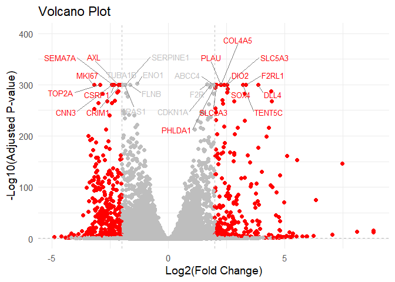
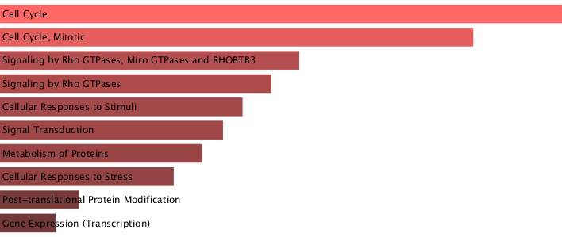
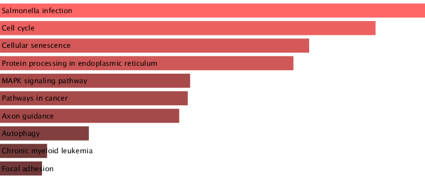

# class13


\##background

\##data import

``` r
url1 <- "https://bioboot.github.io/bggn213_F25/class-material/GSE37704_featurecounts.csv"
url2 <- "https://bioboot.github.io/bggn213_F25/class-material/GSE37704_metadata.csv"

counts <- read.csv(url1, row.names = 1)
metadata <- read.csv(url2)
```

``` r
dim(counts)
```

    [1] 19808     7

``` r
metadata
```

             id     condition
    1 SRR493366 control_sirna
    2 SRR493367 control_sirna
    3 SRR493368 control_sirna
    4 SRR493369      hoxa1_kd
    5 SRR493370      hoxa1_kd
    6 SRR493371      hoxa1_kd

``` r
head(counts)
```

                    length SRR493366 SRR493367 SRR493368 SRR493369 SRR493370
    ENSG00000186092    918         0         0         0         0         0
    ENSG00000279928    718         0         0         0         0         0
    ENSG00000279457   1982        23        28        29        29        28
    ENSG00000278566    939         0         0         0         0         0
    ENSG00000273547    939         0         0         0         0         0
    ENSG00000187634   3214       124       123       205       207       212
                    SRR493371
    ENSG00000186092         0
    ENSG00000279928         0
    ENSG00000279457        46
    ENSG00000278566         0
    ENSG00000273547         0
    ENSG00000187634       258

## setup DESeq

``` r
library(DESeq2)
```

    Warning: package 'DESeq2' was built under R version 4.3.3

    Loading required package: S4Vectors

    Warning: package 'S4Vectors' was built under R version 4.3.2

    Loading required package: stats4

    Loading required package: BiocGenerics

    Warning: package 'BiocGenerics' was built under R version 4.3.1


    Attaching package: 'BiocGenerics'

    The following objects are masked from 'package:stats':

        IQR, mad, sd, var, xtabs

    The following objects are masked from 'package:base':

        anyDuplicated, aperm, append, as.data.frame, basename, cbind,
        colnames, dirname, do.call, duplicated, eval, evalq, Filter, Find,
        get, grep, grepl, intersect, is.unsorted, lapply, Map, mapply,
        match, mget, order, paste, pmax, pmax.int, pmin, pmin.int,
        Position, rank, rbind, Reduce, rownames, sapply, setdiff, sort,
        table, tapply, union, unique, unsplit, which.max, which.min


    Attaching package: 'S4Vectors'

    The following object is masked from 'package:utils':

        findMatches

    The following objects are masked from 'package:base':

        expand.grid, I, unname

    Loading required package: IRanges

    Warning: package 'IRanges' was built under R version 4.3.1


    Attaching package: 'IRanges'

    The following object is masked from 'package:grDevices':

        windows

    Loading required package: GenomicRanges

    Warning: package 'GenomicRanges' was built under R version 4.3.1

    Loading required package: GenomeInfoDb

    Warning: package 'GenomeInfoDb' was built under R version 4.3.3

    Loading required package: SummarizedExperiment

    Warning: package 'SummarizedExperiment' was built under R version 4.3.1

    Loading required package: MatrixGenerics

    Warning: package 'MatrixGenerics' was built under R version 4.3.1

    Loading required package: matrixStats

    Warning: package 'matrixStats' was built under R version 4.3.3


    Attaching package: 'MatrixGenerics'

    The following objects are masked from 'package:matrixStats':

        colAlls, colAnyNAs, colAnys, colAvgsPerRowSet, colCollapse,
        colCounts, colCummaxs, colCummins, colCumprods, colCumsums,
        colDiffs, colIQRDiffs, colIQRs, colLogSumExps, colMadDiffs,
        colMads, colMaxs, colMeans2, colMedians, colMins, colOrderStats,
        colProds, colQuantiles, colRanges, colRanks, colSdDiffs, colSds,
        colSums2, colTabulates, colVarDiffs, colVars, colWeightedMads,
        colWeightedMeans, colWeightedMedians, colWeightedSds,
        colWeightedVars, rowAlls, rowAnyNAs, rowAnys, rowAvgsPerColSet,
        rowCollapse, rowCounts, rowCummaxs, rowCummins, rowCumprods,
        rowCumsums, rowDiffs, rowIQRDiffs, rowIQRs, rowLogSumExps,
        rowMadDiffs, rowMads, rowMaxs, rowMeans2, rowMedians, rowMins,
        rowOrderStats, rowProds, rowQuantiles, rowRanges, rowRanks,
        rowSdDiffs, rowSds, rowSums2, rowTabulates, rowVarDiffs, rowVars,
        rowWeightedMads, rowWeightedMeans, rowWeightedMedians,
        rowWeightedSds, rowWeightedVars

    Loading required package: Biobase

    Warning: package 'Biobase' was built under R version 4.3.1

    Welcome to Bioconductor

        Vignettes contain introductory material; view with
        'browseVignettes()'. To cite Bioconductor, see
        'citation("Biobase")', and for packages 'citation("pkgname")'.


    Attaching package: 'Biobase'

    The following object is masked from 'package:MatrixGenerics':

        rowMedians

    The following objects are masked from 'package:matrixStats':

        anyMissing, rowMedians

remove first col of counts

``` r
counts <- counts[,-1]
head(counts)
```

                    SRR493366 SRR493367 SRR493368 SRR493369 SRR493370 SRR493371
    ENSG00000186092         0         0         0         0         0         0
    ENSG00000279928         0         0         0         0         0         0
    ENSG00000279457        23        28        29        29        28        46
    ENSG00000278566         0         0         0         0         0         0
    ENSG00000273547         0         0         0         0         0         0
    ENSG00000187634       124       123       205       207       212       258

``` r
if (all(colnames(counts) == metadata$id) == FALSE){
  message("check colnames in counts matches metadata")
  exit
}
```

Filter out 0 counts

``` r
zero_count_genes <- rowSums(counts) == 0

filtered_counts <- counts[!zero_count_genes, ]
```

\##run DESeq

``` r
dds <- DESeqDataSetFromMatrix(countData=filtered_counts, 
                              colData=metadata, 
                              design=~condition)
```

    Warning in DESeqDataSet(se, design = design, ignoreRank): some variables in
    design formula are characters, converting to factors

``` r
dds <- DESeq(dds)
```

    estimating size factors

    estimating dispersions

    gene-wise dispersion estimates

    mean-dispersion relationship

    final dispersion estimates

    fitting model and testing

``` r
res<- results(dds)
```

``` r
head(res)
```

    log2 fold change (MLE): condition hoxa1 kd vs control sirna 
    Wald test p-value: condition hoxa1 kd vs control sirna 
    DataFrame with 6 rows and 6 columns
                     baseMean log2FoldChange     lfcSE       stat      pvalue
                    <numeric>      <numeric> <numeric>  <numeric>   <numeric>
    ENSG00000279457   29.9136      0.1792571 0.3248216   0.551863 5.81042e-01
    ENSG00000187634  183.2296      0.4264571 0.1402658   3.040350 2.36304e-03
    ENSG00000188976 1651.1881     -0.6927205 0.0548465 -12.630158 1.43990e-36
    ENSG00000187961  209.6379      0.7297556 0.1318599   5.534326 3.12428e-08
    ENSG00000187583   47.2551      0.0405765 0.2718928   0.149237 8.81366e-01
    ENSG00000187642   11.9798      0.5428105 0.5215598   1.040744 2.97994e-01
                           padj
                      <numeric>
    ENSG00000279457 6.86555e-01
    ENSG00000187634 5.15718e-03
    ENSG00000188976 1.76549e-35
    ENSG00000187961 1.13413e-07
    ENSG00000187583 9.19031e-01
    ENSG00000187642 4.03379e-01

\##add

``` r
library("org.Hs.eg.db")
```

    Loading required package: AnnotationDbi

    Warning: package 'AnnotationDbi' was built under R version 4.3.2

``` r
res$symbol <- mapIds(org.Hs.eg.db,
                     keys=row.names(res), # Our genenames
                     keytype="ENSEMBL",        # The format of our genenames
                     column="SYMBOL",          # The new format we want to add
                     multiVals="first")
```

    'select()' returned 1:many mapping between keys and columns

``` r
res$entrez <- mapIds(org.Hs.eg.db,
                     keys=row.names(res),
                     column="ENTREZID",
                     keytype="ENSEMBL",
                     multiVals="first")
```

    'select()' returned 1:many mapping between keys and columns

## Visualize it!

``` r
library(ggplot2)
library(ggrepel)
```

    Warning: package 'ggrepel' was built under R version 4.3.3

``` r
res$color <- "gray"
res$color[(res$padj < 0.01) & (abs(res$log2FoldChange) > 2)] <- "red"
res$padj[res$padj == 0] <- 1e-300
res$yval <- -log10(res$padj)

top25 <- res[order(res$padj), ][1:25, ]

ggplot(res, aes(x = log2FoldChange, y = yval, color = color)) +
  geom_point() +
  geom_text_repel(
    data = top25,
    aes(label = symbol),
    size = 3.5,
    max.overlaps = Inf,
    box.padding = 0.5,
    segment.color = "gray50"
  ) +
  scale_color_identity() +
  geom_vline(xintercept = c(-2, 2), linetype = "dashed", color = "gray") +
  geom_hline(yintercept = -log10(0.1), linetype = "dashed", color = "gray") +
  labs(
    x = "Log2(Fold Change)",
    y = "-Log10(Adjusted P-value)",
    title = "Volcano Plot"
  ) +
  coord_cartesian(ylim = c(0, 400)) +   
  theme_minimal(base_size = 14)
```

    Warning: Removed 1237 rows containing missing values or values outside the scale range
    (`geom_point()`).



There was some crazy high log10(p-values), so I had to cap them to keep
them in the plot

## saving data

``` r
res = res[order(res$pvalue),]
write.csv(res, file="deseq_results.csv")
```

\##pathway analysis

``` r
library(gage)
```

    Warning: package 'gage' was built under R version 4.3.1

``` r
library(gageData)

data(kegg.sets.hs)
data(sigmet.idx.hs)
kegg.sets.hs = kegg.sets.hs[sigmet.idx.hs]
```

``` r
foldchanges = res$log2FoldChange
names(foldchanges) = res$entrez
keggres = gage(foldchanges, gsets=kegg.sets.hs)
head(keggres$less)
```

                                             p.geomean stat.mean        p.val
    hsa04110 Cell cycle                   8.995727e-06 -4.378644 8.995727e-06
    hsa03030 DNA replication              9.424076e-05 -3.951803 9.424076e-05
    hsa03013 RNA transport                1.375901e-03 -3.028500 1.375901e-03
    hsa03440 Homologous recombination     3.066756e-03 -2.852899 3.066756e-03
    hsa04114 Oocyte meiosis               3.784520e-03 -2.698128 3.784520e-03
    hsa00010 Glycolysis / Gluconeogenesis 8.961413e-03 -2.405398 8.961413e-03
                                                q.val set.size         exp1
    hsa04110 Cell cycle                   0.001448312      121 8.995727e-06
    hsa03030 DNA replication              0.007586381       36 9.424076e-05
    hsa03013 RNA transport                0.073840037      144 1.375901e-03
    hsa03440 Homologous recombination     0.121861535       28 3.066756e-03
    hsa04114 Oocyte meiosis               0.121861535      102 3.784520e-03
    hsa00010 Glycolysis / Gluconeogenesis 0.212222694       53 8.961413e-03

``` r
head(keggres$greater)
```

                                            p.geomean stat.mean       p.val
    hsa04640 Hematopoietic cell lineage   0.002822776  2.833362 0.002822776
    hsa04630 Jak-STAT signaling pathway   0.005202070  2.585673 0.005202070
    hsa00140 Steroid hormone biosynthesis 0.007255099  2.526744 0.007255099
    hsa04142 Lysosome                     0.010107392  2.338364 0.010107392
    hsa04330 Notch signaling pathway      0.018747253  2.111725 0.018747253
    hsa04916 Melanogenesis                0.019399766  2.081927 0.019399766
                                              q.val set.size        exp1
    hsa04640 Hematopoietic cell lineage   0.3893570       55 0.002822776
    hsa04630 Jak-STAT signaling pathway   0.3893570      109 0.005202070
    hsa00140 Steroid hormone biosynthesis 0.3893570       31 0.007255099
    hsa04142 Lysosome                     0.4068225      118 0.010107392
    hsa04330 Notch signaling pathway      0.4391731       46 0.018747253
    hsa04916 Melanogenesis                0.4391731       90 0.019399766

``` r
library(pathview)
```

    Warning: package 'pathview' was built under R version 4.3.1

    ##############################################################################
    Pathview is an open source software package distributed under GNU General
    Public License version 3 (GPLv3). Details of GPLv3 is available at
    http://www.gnu.org/licenses/gpl-3.0.html. Particullary, users are required to
    formally cite the original Pathview paper (not just mention it) in publications
    or products. For details, do citation("pathview") within R.

    The pathview downloads and uses KEGG data. Non-academic uses may require a KEGG
    license agreement (details at http://www.kegg.jp/kegg/legal.html).
    ##############################################################################

``` r
pathview(gene.data=foldchanges, pathway.id="hsa04110")
```

    'select()' returned 1:1 mapping between keys and columns

    Info: Working in directory C:/Users/marik/OneDrive/Documents/MW lab/Bioinfo class/bggn213_MW/class12

    Info: Writing image file hsa04110.pathview.png


``` r
upkeggrespathways <- rownames(keggres$greater)[1:5]
upkeggresids = substr(upkeggrespathways, start=1, stop=8)
upkeggresids
```

    [1] "hsa04640" "hsa04630" "hsa00140" "hsa04142" "hsa04330"

``` r
downkeggrespathways <- rownames(keggres$less)[1:5]
downkeggresids = substr(downkeggrespathways, start=1, stop=8)
downkeggresids
```

    [1] "hsa04110" "hsa03030" "hsa03013" "hsa03440" "hsa04114"

``` r
pathview(gene.data=foldchanges, pathway.id=upkeggresids, species="hsa")
```

    'select()' returned 1:1 mapping between keys and columns

    Info: Working in directory C:/Users/marik/OneDrive/Documents/MW lab/Bioinfo class/bggn213_MW/class12

    Info: Writing image file hsa04640.pathview.png

    'select()' returned 1:1 mapping between keys and columns

    Info: Working in directory C:/Users/marik/OneDrive/Documents/MW lab/Bioinfo class/bggn213_MW/class12

    Info: Writing image file hsa04630.pathview.png

    'select()' returned 1:1 mapping between keys and columns

    Info: Working in directory C:/Users/marik/OneDrive/Documents/MW lab/Bioinfo class/bggn213_MW/class12

    Info: Writing image file hsa00140.pathview.png

    'select()' returned 1:1 mapping between keys and columns

    Info: Working in directory C:/Users/marik/OneDrive/Documents/MW lab/Bioinfo class/bggn213_MW/class12

    Info: Writing image file hsa04142.pathview.png

    'select()' returned 1:1 mapping between keys and columns

    Info: Working in directory C:/Users/marik/OneDrive/Documents/MW lab/Bioinfo class/bggn213_MW/class12

    Info: Writing image file hsa04330.pathview.png

``` r
pathview(gene.data=foldchanges, pathway.id=downkeggresids, species="hsa")
```

    'select()' returned 1:1 mapping between keys and columns

    Info: Working in directory C:/Users/marik/OneDrive/Documents/MW lab/Bioinfo class/bggn213_MW/class12

    Info: Writing image file hsa04110.pathview.png

    'select()' returned 1:1 mapping between keys and columns

    Info: Working in directory C:/Users/marik/OneDrive/Documents/MW lab/Bioinfo class/bggn213_MW/class12

    Info: Writing image file hsa03030.pathview.png

    'select()' returned 1:1 mapping between keys and columns

    Info: Working in directory C:/Users/marik/OneDrive/Documents/MW lab/Bioinfo class/bggn213_MW/class12

    Info: Writing image file hsa03013.pathview.png

    'select()' returned 1:1 mapping between keys and columns

    Info: Working in directory C:/Users/marik/OneDrive/Documents/MW lab/Bioinfo class/bggn213_MW/class12

    Info: Writing image file hsa03440.pathview.png

    'select()' returned 1:1 mapping between keys and columns

    Info: Working in directory C:/Users/marik/OneDrive/Documents/MW lab/Bioinfo class/bggn213_MW/class12

    Info: Writing image file hsa04114.pathview.png

\##GO

``` r
data(go.sets.hs)
data(go.subs.hs)
gobpsets = go.sets.hs[go.subs.hs$BP]

gobpres = gage(foldchanges, gsets=gobpsets, same.dir=TRUE)

lapply(gobpres, head)
```

    $greater
                                                 p.geomean stat.mean        p.val
    GO:0007156 homophilic cell adhesion       8.519724e-05  3.824205 8.519724e-05
    GO:0002009 morphogenesis of an epithelium 1.396681e-04  3.653886 1.396681e-04
    GO:0048729 tissue morphogenesis           1.432451e-04  3.643242 1.432451e-04
    GO:0007610 behavior                       1.925222e-04  3.565432 1.925222e-04
    GO:0060562 epithelial tube morphogenesis  5.932837e-04  3.261376 5.932837e-04
    GO:0035295 tube development               5.953254e-04  3.253665 5.953254e-04
                                                  q.val set.size         exp1
    GO:0007156 homophilic cell adhesion       0.1952430      113 8.519724e-05
    GO:0002009 morphogenesis of an epithelium 0.1952430      339 1.396681e-04
    GO:0048729 tissue morphogenesis           0.1952430      424 1.432451e-04
    GO:0007610 behavior                       0.1968058      426 1.925222e-04
    GO:0060562 epithelial tube morphogenesis  0.3566193      257 5.932837e-04
    GO:0035295 tube development               0.3566193      391 5.953254e-04

    $less
                                                p.geomean stat.mean        p.val
    GO:0048285 organelle fission             1.536227e-15 -8.063910 1.536227e-15
    GO:0000280 nuclear division              4.286961e-15 -7.939217 4.286961e-15
    GO:0007067 mitosis                       4.286961e-15 -7.939217 4.286961e-15
    GO:0000087 M phase of mitotic cell cycle 1.169934e-14 -7.797496 1.169934e-14
    GO:0007059 chromosome segregation        2.028624e-11 -6.878340 2.028624e-11
    GO:0000236 mitotic prometaphase          1.729553e-10 -6.695966 1.729553e-10
                                                    q.val set.size         exp1
    GO:0048285 organelle fission             5.843127e-12      376 1.536227e-15
    GO:0000280 nuclear division              5.843127e-12      352 4.286961e-15
    GO:0007067 mitosis                       5.843127e-12      352 4.286961e-15
    GO:0000087 M phase of mitotic cell cycle 1.195965e-11      362 1.169934e-14
    GO:0007059 chromosome segregation        1.659009e-08      142 2.028624e-11
    GO:0000236 mitotic prometaphase          1.178690e-07       84 1.729553e-10

    $stats
                                              stat.mean     exp1
    GO:0007156 homophilic cell adhesion        3.824205 3.824205
    GO:0002009 morphogenesis of an epithelium  3.653886 3.653886
    GO:0048729 tissue morphogenesis            3.643242 3.643242
    GO:0007610 behavior                        3.565432 3.565432
    GO:0060562 epithelial tube morphogenesis   3.261376 3.261376
    GO:0035295 tube development                3.253665 3.253665

\##reactome

``` r
sig_genes <- res[res$padj <= 0.05 & !is.na(res$padj), "symbol"]
print(paste("Total number of significant genes:", length(sig_genes)))
```

    [1] "Total number of significant genes: 8147"

``` r
write.table(sig_genes, file="significant_genes.txt", row.names=FALSE, col.names=FALSE, quote=FALSE)
```

``` r
sig_entrez <- res[res$padj <= 0.05 & !is.na(res$padj), "entrez"]
write.table(sig_genes, file="significant_genes.txt", row.names=FALSE, col.names=FALSE, quote=FALSE)
```

Also tried enrichR for some interesting pathways!



