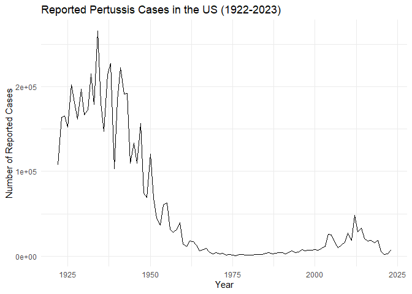
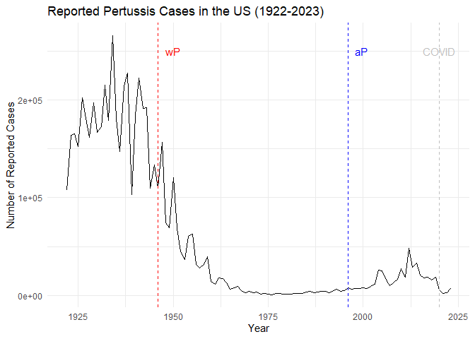
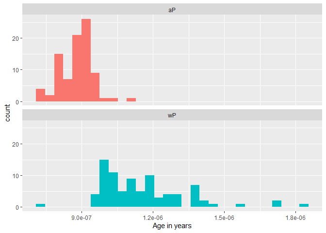
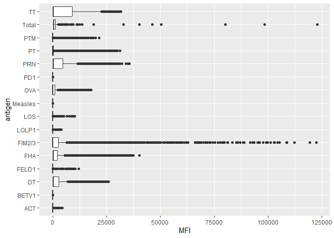
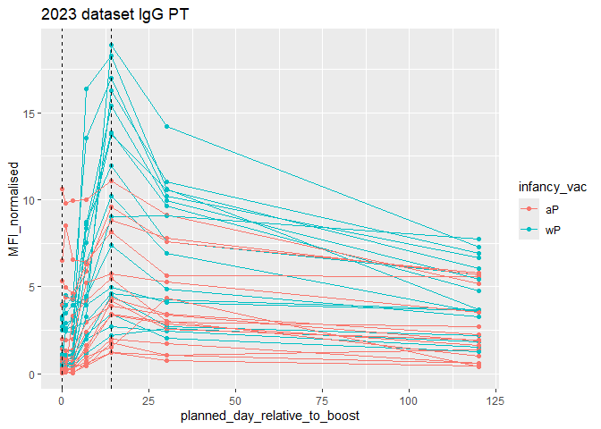

# Pertussis Mini Project
Mari Williams (A15858833)

\###Q1

``` r
library(ggplot2)
ggplot(cdc) +
  geom_line(aes(x = Year, y = No..Reported.Pertussis.Cases)) +
  labs(title = "Reported Pertussis Cases in the US (1922-2023)",
       x = "Year",
       y = "Number of Reported Cases") +
  theme_minimal()
```



\###Q2

``` r
ggplot(cdc) +
  geom_line(aes(x = Year, y = No..Reported.Pertussis.Cases)) +
  labs(title = "Reported Pertussis Cases in the US (1922-2023)",
       x = "Year",
       y = "Number of Reported Cases") +
  theme_minimal() + geom_vline(xintercept = 1946, linetype="dashed", 
              color = "red", size=.5) +
  annotate("text", x = 1950, y = 250000, label = " wP ", color = "red") + geom_vline(xintercept = 1996, linetype="dashed", 
              color = "blue", size=.5) +
  annotate("text", x = 2000, y = 250000, label = "aP ", color = "blue") +geom_vline(xintercept = 2020, linetype="dashed", 
              color = "gray", size=.5) +
  annotate("text", x = 2020, y = 250000, label = " COVID ", color = "gray") 
```

    Warning: Using `size` aesthetic for lines was deprecated in ggplot2 3.4.0.
    ℹ Please use `linewidth` instead.



\###Q3 There is gradual increase in pertussis cases after the aP
introduction, followed by a few spikes. This is likely due to a growing
anti-vaccination movement in the US. It is also due to the fact that aP
vaccines do not provide as long-lasting immunity as wP vaccines. The
decrease in cases during the COVID-19 pandemic is likely due to social
distancing and mask-wearing measures that were implemented to reduce the
spread of COVID-19, which also reduced the spread of pertussis.

``` r
(library(jsonlite))
```

    Warning: package 'jsonlite' was built under R version 4.3.3

    [1] "jsonlite"  "ggplot2"   "stats"     "graphics"  "grDevices" "utils"    
    [7] "datasets"  "methods"   "base"     

``` r
subject <- read_json("https://www.cmi-pb.org/api/subject", simplifyVector = TRUE) 
```

``` r
head(subject, 3)
```

      subject_id infancy_vac biological_sex              ethnicity  race
    1          1          wP         Female Not Hispanic or Latino White
    2          2          wP         Female Not Hispanic or Latino White
    3          3          wP         Female                Unknown White
      year_of_birth date_of_boost      dataset
    1    1986-01-01    2016-09-12 2020_dataset
    2    1968-01-01    2019-01-28 2020_dataset
    3    1983-01-01    2016-10-10 2020_dataset

\##Q4, Q5, Q6

``` r
table(subject$infancy_vac)
```


    aP wP 
    87 85 

``` r
table(subject$biological_sex)
```


    Female   Male 
       112     60 

``` r
table(subject$biological_sex, subject$race)
```

            
             American Indian/Alaska Native Asian Black or African American
      Female                             0    32                         2
      Male                               1    12                         3
            
             More Than One Race Native Hawaiian or Other Pacific Islander
      Female                 15                                         1
      Male                    4                                         1
            
             Unknown or Not Reported White
      Female                      14    48
      Male                         7    32

\###Q7 and Q8

``` r
library(lubridate)
```

    Warning: package 'lubridate' was built under R version 4.3.3


    Attaching package: 'lubridate'

    The following objects are masked from 'package:base':

        date, intersect, setdiff, union

``` r
for (i in 1:(length(subject$year_of_birth))) {
  subject$age_years[i] <- as.numeric(time_length( today() - ymd(subject$year_of_birth[i]),  "years"))
}
```

``` r
library(dplyr)
```

    Warning: package 'dplyr' was built under R version 4.3.3


    Attaching package: 'dplyr'

    The following objects are masked from 'package:stats':

        filter, lag

    The following objects are masked from 'package:base':

        intersect, setdiff, setequal, union

``` r
ap <- subject %>% filter(infancy_vac == "aP")
mean(ap$age_years, na.rm = TRUE)
```

    [1] 27.82827

``` r
wp <- subject %>% filter(infancy_vac == "wP")
mean(wp$age_years, na.rm = TRUE)
```

    [1] 36.57897

``` r
int <- ymd(subject$date_of_boost) - ymd(subject$year_of_birth)
age_at_boost <- time_length(int, "year")
head(age_at_boost)
```

    [1] 30.69678 51.07461 33.77413 28.65982 25.65914 28.77481

``` r
ggplot(subject) +
  aes(time_length(age_years, "year"),
      fill=as.factor(infancy_vac)) +
  geom_histogram(show.legend=FALSE) +
  facet_wrap(vars(infancy_vac), nrow=2) +
  xlab("Age in years")
```

    `stat_bin()` using `bins = 30`. Pick better value `binwidth`.



Yes, wP group is older and more spread out

``` r
specimen <- read_json("https://www.cmi-pb.org/api/specimen", simplifyVector = TRUE) 
titer <- read_json("https://www.cmi-pb.org/api/plasma_ab_titer", simplifyVector = TRUE) 
head(specimen)
```

      specimen_id subject_id actual_day_relative_to_boost
    1           1          1                           -3
    2           2          1                            1
    3           3          1                            3
    4           4          1                            7
    5           5          1                           11
    6           6          1                           32
      planned_day_relative_to_boost specimen_type visit
    1                             0         Blood     1
    2                             1         Blood     2
    3                             3         Blood     3
    4                             7         Blood     4
    5                            14         Blood     5
    6                            30         Blood     6

\##Q6

\##Q7

``` r
unique(titer$antigen)
```

     [1] "Total"   "PT"      "PRN"     "FHA"     "ACT"     "LOS"     "FELD1"  
     [8] "BETV1"   "LOLP1"   "Measles" "PTM"     "FIM2/3"  "TT"      "DT"     
    [15] "OVA"     "PD1"    

\###Q8

``` r
ggplot(titer)+ aes(MFI, antigen) +
  geom_boxplot()
```

    Warning: Removed 1 row containing non-finite outside the scale range
    (`stat_boxplot()`).



\###Q9 and Q10

``` r
library(dplyr)
meta <- inner_join(specimen, subject)
```

    Joining with `by = join_by(subject_id)`

``` r
head(meta)
```

      specimen_id subject_id actual_day_relative_to_boost
    1           1          1                           -3
    2           2          1                            1
    3           3          1                            3
    4           4          1                            7
    5           5          1                           11
    6           6          1                           32
      planned_day_relative_to_boost specimen_type visit infancy_vac biological_sex
    1                             0         Blood     1          wP         Female
    2                             1         Blood     2          wP         Female
    3                             3         Blood     3          wP         Female
    4                             7         Blood     4          wP         Female
    5                            14         Blood     5          wP         Female
    6                            30         Blood     6          wP         Female
                   ethnicity  race year_of_birth date_of_boost      dataset
    1 Not Hispanic or Latino White    1986-01-01    2016-09-12 2020_dataset
    2 Not Hispanic or Latino White    1986-01-01    2016-09-12 2020_dataset
    3 Not Hispanic or Latino White    1986-01-01    2016-09-12 2020_dataset
    4 Not Hispanic or Latino White    1986-01-01    2016-09-12 2020_dataset
    5 Not Hispanic or Latino White    1986-01-01    2016-09-12 2020_dataset
    6 Not Hispanic or Latino White    1986-01-01    2016-09-12 2020_dataset
      age_years
    1  39.93155
    2  39.93155
    3  39.93155
    4  39.93155
    5  39.93155
    6  39.93155

``` r
dim(meta)
```

    [1] 1503   14

``` r
abdata<- inner_join(meta, titer)
```

    Joining with `by = join_by(specimen_id)`

``` r
head(abdata)
```

      specimen_id subject_id actual_day_relative_to_boost
    1           1          1                           -3
    2           1          1                           -3
    3           1          1                           -3
    4           1          1                           -3
    5           1          1                           -3
    6           1          1                           -3
      planned_day_relative_to_boost specimen_type visit infancy_vac biological_sex
    1                             0         Blood     1          wP         Female
    2                             0         Blood     1          wP         Female
    3                             0         Blood     1          wP         Female
    4                             0         Blood     1          wP         Female
    5                             0         Blood     1          wP         Female
    6                             0         Blood     1          wP         Female
                   ethnicity  race year_of_birth date_of_boost      dataset
    1 Not Hispanic or Latino White    1986-01-01    2016-09-12 2020_dataset
    2 Not Hispanic or Latino White    1986-01-01    2016-09-12 2020_dataset
    3 Not Hispanic or Latino White    1986-01-01    2016-09-12 2020_dataset
    4 Not Hispanic or Latino White    1986-01-01    2016-09-12 2020_dataset
    5 Not Hispanic or Latino White    1986-01-01    2016-09-12 2020_dataset
    6 Not Hispanic or Latino White    1986-01-01    2016-09-12 2020_dataset
      age_years isotype is_antigen_specific antigen        MFI MFI_normalised  unit
    1  39.93155     IgE               FALSE   Total 1110.21154       2.493425 UG/ML
    2  39.93155     IgE               FALSE   Total 2708.91616       2.493425 IU/ML
    3  39.93155     IgG                TRUE      PT   68.56614       3.736992 IU/ML
    4  39.93155     IgG                TRUE     PRN  332.12718       2.602350 IU/ML
    5  39.93155     IgG                TRUE     FHA 1887.12263      34.050956 IU/ML
    6  39.93155     IgE                TRUE     ACT    0.10000       1.000000 IU/ML
      lower_limit_of_detection
    1                 2.096133
    2                29.170000
    3                 0.530000
    4                 6.205949
    5                 4.679535
    6                 2.816431

``` r
dim(abdata)
```

    [1] 52576    21

\###Q11

``` r
table(abdata$isotype)
```


      IgE   IgG  IgG1  IgG2  IgG3  IgG4 
     6698  5389 10117 10124 10124 10124 

\###Q12

``` r
table(abdata$dataset)
```


    2020_dataset 2021_dataset 2022_dataset 2023_dataset 
           31520         8085         7301         5670 

There’s 4 different dataset years. They decrease in size from 2020 to
2023, with 2023 being the smallest.

\##Q13

``` r
igg <- abdata %>% filter(isotype == "IgG")
ggplot(igg) +
  aes(x = MFI_normalised, y = antigen) +
  geom_boxplot() + 
    xlim(0,75) +
  facet_wrap(vars(visit), nrow=2)
```

    Warning: Removed 5 rows containing non-finite outside the scale range
    (`stat_boxplot()`).


### Q14 Time course analysis

``` r
abdata.tc <- abdata %>% filter(dataset == "2021_dataset")

abdata.tc %>% 
  filter(isotype == "IgG",  antigen == "PT") %>%
  ggplot() +
    aes(x=planned_day_relative_to_boost,
        y=MFI_normalised,
        col=infancy_vac,
        group=subject_id) +
    geom_point() +
    geom_line() +
    geom_vline(xintercept=0, linetype="dashed") +
    geom_vline(xintercept=14, linetype="dashed") +
  labs(title="2023 dataset IgG PT")
```


